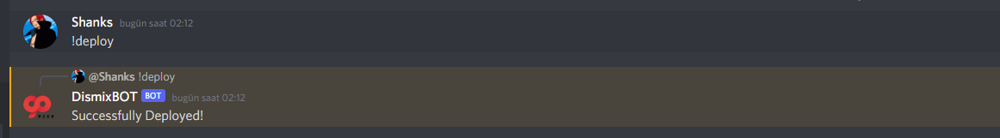
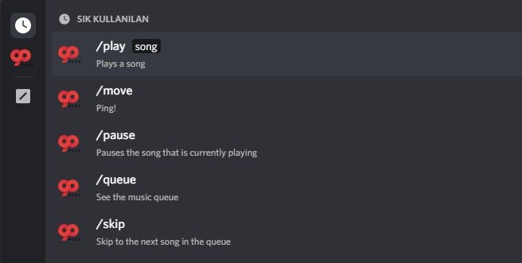
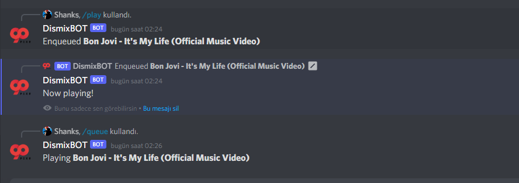
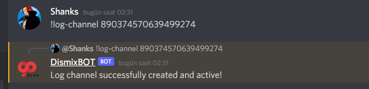
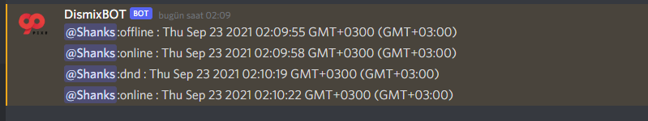
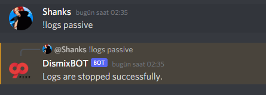
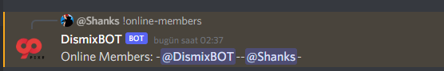
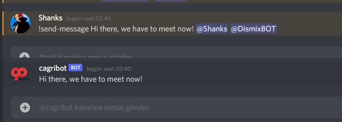
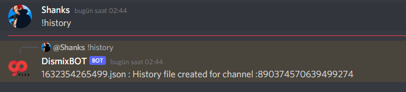

  

# Dismix Bot

## Description

You can listen to music on youtube, write channel messages to a file and see user logs.


## Installation

Builded with NestJS

```bash
$ https://github.com/90pixel/dismix-discord-bot
$ cd dismix-discord-bot
$ npm install
```
Fill the .env variables and setup your db for logs and new feautres


## Run with docker

>Note: Docker files uses .dev.env

```docker
docker-compose up -d
```

## Running the app

```bash
# dev mode
$ npm run start:dev

# production mode
$ npm run start:prod
```

### Alternative
```bash
$ pm2 startOrRestart ecosystem.config.js --only dismix-bot-`$env` --env `$env` && pm2 save
```

## Permissions

* Application uses slash commands. So you have to ``applications.commands`` enabled.

## Deploying Commands
> Note: Only bot author can do this command.

Before using bot with music feature, you have to deploy commands to your Discord Server. Use ``!deploy`` command to do.



After use ``!deploy`` command you can see commands by typing a ``slash``



## Features & Commands

### Slash Commands

* Play music with given YouTube Url

``/play YouTubeURL``

* Show queued list

``/queue``
  
* Skip current song

``/skip``

* Pause current song

```/pause```

* Resume current song

``/resume``

* Leave from channel

``/leave``




### Prefixed Commands ``!``

* You can check user presence updates with setting a log channel for it. Only bot author can do it. Basically you can get the channel id by clicking channel with right click then copy the ID.

```!log-channel {$channelId}```



Either way you can update your log channel too.

After create a log channel, you will able to see presence updates with their time.



* You can set log status active or passive

``!logs active``

``!logs passive``



* Show Online & Offline Members

``!online-members``

``!offline-members``




* Send private message to mentioned users.
```!send-message [message] @Shanks @.. @.. @..```



* History of a channel as json and save the root directory

``!history``



```json
[
    {
        "username": "Shanks",
        "timestamp": "23/09/2021 - 02:44:25 AM",
        "content": "!history"
    },
    {
        "username": "Biohazard",
        "timestamp": "23/09/2021 - 02:31:49 AM",
        "content": "Hello!"
    },
    {
        "username": "Shanks",
        "timestamp": "23/09/2021 - 02:12:02 AM",
        "content": "!deploy"
    }
]
```

## Contributing

Feel free the pull request.

## Author

[Çağrı Sungur](https://github.com/cagrisungur) - Part of 90Pixel Team

## License

This project is licensed under the MIT License - see the [LICENSE.md](LICENSE) file for details


